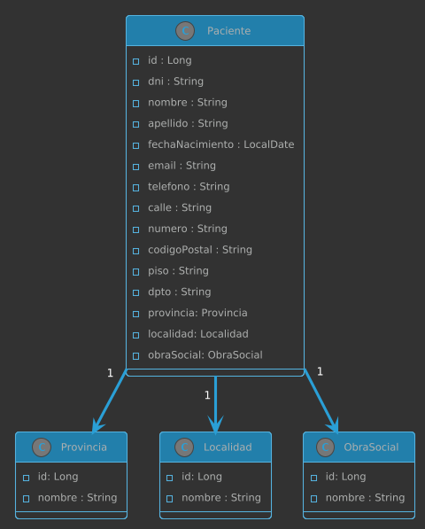

# API de Pacientes

Esta API permite **gestionar pacientes**: crear, listar, actualizar y buscar pacientes en el sistema.

Base URL: `http://localhost:8080/api/pacientes`


## Diagrama Clases




---

## Endpoints - POSTMAN

### 1. Listar pacientes

- **Método:** GET
- **Ruta:** `/api/pacientes`
- **Descripción:** Devuelve la lista de pacientes registrados.
- **Response (200 OK):**


  ```json
  [ 
    {
      "id": 1,
      "dni": "12345678",
      "nombre": "Juan",
      "apellido": "Pérez",
      "email": "juan.perez@mail.com",
      "telefono": "3511234567",
      "fechaNacimiento": "1990-05-10",
      "calle": "Av. Siempre Viva",
      "numero": "742",
      "codigoPostal": "5000",
      "provinciaNombre": "Cordoba",
      "localidadNombre": "Capital",
      "obraSocialNombre": "OSDE"
    }
  ]
  ```

---

### 2. Obtener paciente por ID

- **Método:** GET
- **Ruta:** `/api/pacientes/{id}`
- **Descripción:** Devuelve un paciente específico por su ID.
  - **Response (200 OK):**
  - **Response (404 Not Found):**

---

### 3. Crear paciente

- **Método:** POST
- **Ruta:** `/api/pacientes`
- **Descripción:** Crea un nuevo paciente en el sistema.
- **Request Body:**

    ```json
    {
      "dni": "87654321",
      "nombre": "Maria",
      "apellido": "Gómez",
      "email": "maria.gomez@mail.com",
      "telefono": "3519876543",
      "fechaNacimiento": "1985-03-20",
      "calle": "San Martín",
      "numero": "123",
      "codigoPostal": "5001",
      "provinciaId": 2,
      "localidadId": 8,
      "obraSocialId": 1
    }
    ```

---

### 4. Actualizar paciente

- **Método:** PUT
- **Ruta:** `/api/pacientes/{id}`
- **Descripción:** Actualiza los datos de un paciente existente.
- **Request Body:**

    ```json
    {
      "dni": "87654321",
      "nombre": "Maria Laura",
      "apellido": "Gómez",
      "email": "maria.gomez@mail.com",
      "telefono": "3519876543",
      "fechaNacimiento": "1985-03-20",
      "calle": "San Martín",
      "numero": "123",
      "codigoPostal": "5001",
      "provinciaId": 2,
      "localidadId": 8,
      "obraSocialId": 1
    }
    ```


---

### 5. Buscar pacientes

- **Método:** GET
- **Ruta:** `/api/pacientes/buscar`
- **Parámetros opcionales:**
    - `dni` (string)
    - `nombre` (string)
- **Descripción:** Permite buscar pacientes filtrando por DNI o nombre.
- **Response (200 OK):**

Ejemplos
- http://localhost:8080/api/pacientes/buscar?nombre=maria
- http://localhost:8080/api/pacientes/buscar?dni=12345678
- http://localhost:8080/api/pacientes/buscar?dni=12345678&nombre=Juan
