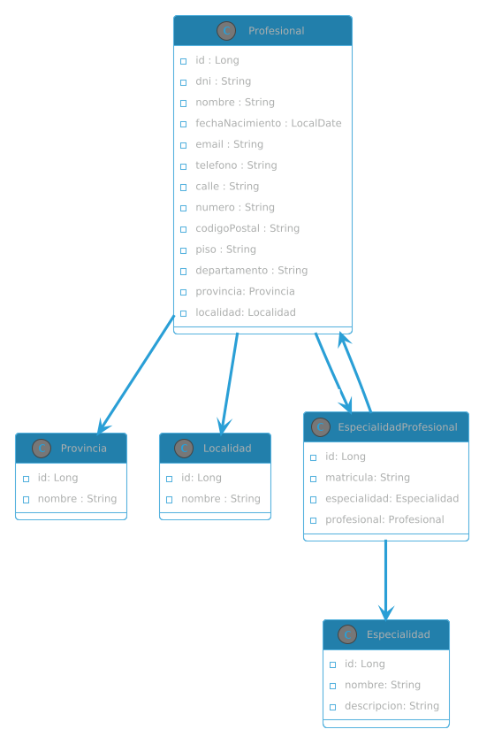

# 📘 Documentación de la API - Centro de Salud

## 🔹 Profesionales

### POST /profesionales
- Crea un nuevo profesional
- Body (JSON):
```json
{
  "nombre": "Laura Gómez",
  "dni": "12345678",
  "email": "laura@example.com",
  "telefono": "3511234567",
  "calle": "Av. Siempre Viva",
  "numero": "742",
  "codigoPostal": "5000",
  "piso": "2",
  "departamento": "A",
  "provinciaId": 1,
  "localidadId": 10,
  "especialidadesConMatricula": [
    {
      "especialidadId": 3,
      "matricula": "MG12345"
    }
  ]
}
```

ejemplo:
> POST http://localhost:8080/profesionales

### GET /profesionales
- Devuelve todos los profesionales registrados

ejemplo:
> GET http://localhost:8080/profesionales

### GET /profesionales/{id}

- Devuelve un profesional por su ID

ejemplo:
> GET http://localhost:8080/profesionales/1


### PUT /profesionales/{id}

- Actualiza un profesional existente
- Body igual al POST

ejemplo:
> PUT http://localhost:8080/profesionales/1


### DELETE /profesionales/{id}

- Elimina un profesional por su ID

ejemplo:
> DELETE http://localhost:8080/profesionales/1


### GET /profesionales/buscar

- Busca profesionales con filtros opcionales 
- Parámetros:
  - nombre (String)
  - especialidadId (Long)
  - provinciaId (Long)
  - localidadId (Long)

ejemplo:
> GET http://localhost:8080/profesionales/buscar?nombre=gabriel

> GET http://localhost:8080/profesionales/buscar?especialidadId=3

> GET http://localhost:8080/profesionales/buscar?localidadId=10

> GET http://localhost:8080/profesionales/buscar?nombre=gabriel&especialidadId=3&provinciaId=1&localidadId=10

## 🔹 Especialidades

### GET /api/especialidades
- Devuelve todas las especialidades disponibles

ejemplo:
> GET http://localhost:8080/api/especialidades

### POST /api/especialidades
- Crea una nueva especialidad 
- Body (JSON):

    ```json
    {
      "nombre": "Cardiología",
      "descripcion": "Especialidad médica del corazón"
    }
    
    ```
ejemplo:
> POST http://localhost:8080/api/especialidades


### PUT /api/especialidades/{id}

- Actualiza una especialidad existente 
- Body igual al POST

ejemplo:
> PUT http://localhost:8080/api/especialidades/1

### DELETE /api/especialidades/{id}

- Elimina una especialidad por su ID

ejemplo:
> DELETE http://localhost:8080/api/especialidades/1

## 🔹 Provincias

### GET /api/provincias
- Devuelve todos las provincias registradas (estan cargadas todas las de argentina)

ejemplo:
> GET http://localhost:8080/api/provincias

## 🔹 Localidad

### GET /api/localidades
- Devuelve todos las localidades registradas para cierta provincia

ejemplo:
> GET http://localhost:8080/api/localidades?provinciaId=5
